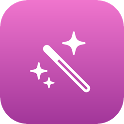

# PlainPaste



A tiny, dependency-free macOS menu bar app that strips formatting from your clipboard and pastes plain text — triggered by a fully customizable global keyboard shortcut.

### [⬇️ Download the latest version](https://github.com/xtrageneric/PlainPaste/releases/latest/download/PlainPaste.dmg)

Open the downloaded `.dmg` and drag PlainPaste into your Applications folder. (See [Building it yourself](#building-it-yourself) below if you'd rather build from source.)

Since this build isn't signed/notarized by Apple, macOS will likely refuse to open it the first time with a *"PlainPaste" Not Opened — Apple could not verify "PlainPaste" is free of malware* warning. Don't click "Move to Trash" — click **Done**, then do one of the following (only needed once):

- Go to **System Settings → Privacy & Security**, scroll down, and click **Open Anyway** next to the PlainPaste message.
- Or, in Finder, right-click (or Control-click) PlainPaste.app and choose **Open** from the menu — this shows a dialog with an explicit **Open** button.

## What it does

- Lives quietly in the menu bar with a customizable icon
- Press your shortcut (default: `fn+Shift+V`) anywhere on macOS to paste the most recent clipboard item as plain text — no fonts, colors, or links
- Regular `⌘V` continues to work completely normally everywhere, untouched
- A little sparkle animation plays at your cursor when the magic happens (customizable color and style)

## Features

- **Fully customizable global shortcut** — record any key combination, with a live preview
- **Menu bar icon picker** — choose from 8 fun icon/name combos
- **Sparkle paste effect** — toggle on/off, pick a color (including a full custom color picker), and choose an animation style (Burst, Rising Dust, Twinkle)
- **Launch at Login** toggle
- **First-launch onboarding** that explains the app and lets you set your shortcut immediately
- **Reset to Defaults** in one click
- **Accessibility permission monitoring** — warns you in the menu if the permission the shortcut depends on gets revoked

No clipboard history, no sync, no bloat — just this one thing, done well.

## Requirements

- macOS 13 (Ventura) or later
- Apple Silicon Mac (M1 or later)

## Building it yourself

1. Clone this repository.
2. Open `PlainPaste.xcodeproj` in Xcode.
3. Click Run, or use the included script:
   ```
   ./build_and_install.sh
   ```
   This builds the app and installs it to `/Applications/PlainPaste.app`.

On first launch, PlainPaste will ask for **Accessibility** and **Input Monitoring** permissions in System Settings — both are required for the global shortcut to work.

## Project structure

| File | Purpose |
|---|---|
| `PlainPasteApp.swift` | Menu bar UI (the dropdown menu itself) |
| `HotkeyManager.swift` | Global shortcut detection and the actual paste logic |
| `Shortcut.swift` | The shortcut data model and key-code name mapping |
| `ShortcutRecorder.swift` | The "press a new shortcut" recording UI |
| `Onboarding.swift` | First-launch welcome window |
| `SparkleEffect.swift` | The paste animation and its settings |
| `IconStore.swift` | Menu bar icon options |
| `LaunchAtLogin.swift` | Launch-at-login toggle |
| `PermissionMonitor.swift` | Watches for Accessibility permission being revoked |
| `AppState.swift` | Shared app-level actions (opening windows, resetting defaults) |

Any new `.swift` file added to the `PlainPaste/PlainPaste/` folder is automatically picked up by the build — no Xcode project editing required.

## Versioning

This project uses a simple `MAJOR.MINOR` scheme. A version bump means something user-visible changed; pure internal refactors don't get a new number. Each version is tagged in git.

## License

MIT — see [LICENSE](LICENSE).
